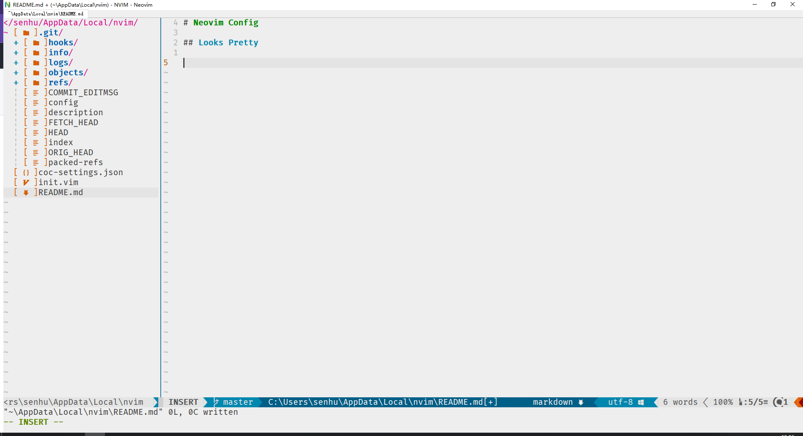
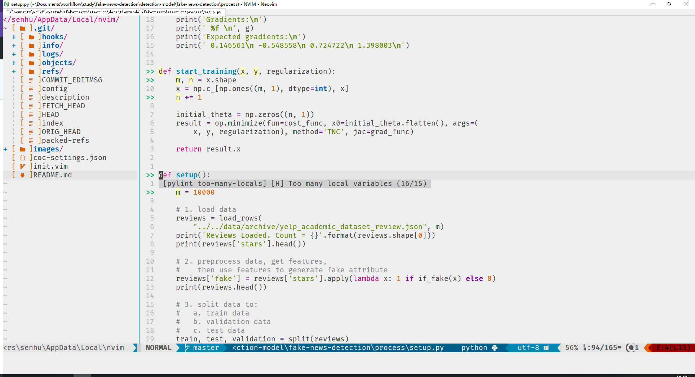

# Neovim Config

## Looks Pretty





## Plugins

```vim
"""""" Plugin
call plug#begin()
    " Appearance
    Plug 'vim-airline/vim-airline' " pleasant air line
    Plug 'vim-airline/vim-airline-themes'
    Plug 'ryanoasis/vim-devicons' " show icons in the interface

    " Utilities
    Plug 'sheerun/vim-polyglot' " syntax highlighting
    Plug 'jiangmiao/auto-pairs' " automatically close delimiters
    Plug 'ap/vim-css-color' " show colors directly in the code
    Plug 'preservim/nerdtree' " sidebar to project files

    " Completion / linters / formatters
    Plug 'neoclide/coc.nvim',  {'branch': 'release'} " provides auto-completion
    Plug 'plasticboy/vim-markdown' " markdown support
    " Git
    Plug 'airblade/vim-gitgutter' " show git changes in open files
    " Color Scheme
    Plug 'morhetz/gruvbox'
    Plug 'NLKNguyen/papercolor-theme'
    " Fuzzy file, buffer, mru, tag
    Plug 'ctrlpvim/ctrlp.vim'
    " Indent Line
    Plug 'Yggdroot/indentLine'
    " Clear unuseful whitespaces
    Plug 'ntpeters/vim-better-whitespace'
    " Git
    Plug 'tpope/vim-fugitive'
    " comment
    Plug 'preservim/nerdcommenter'
call plug#end()
```
