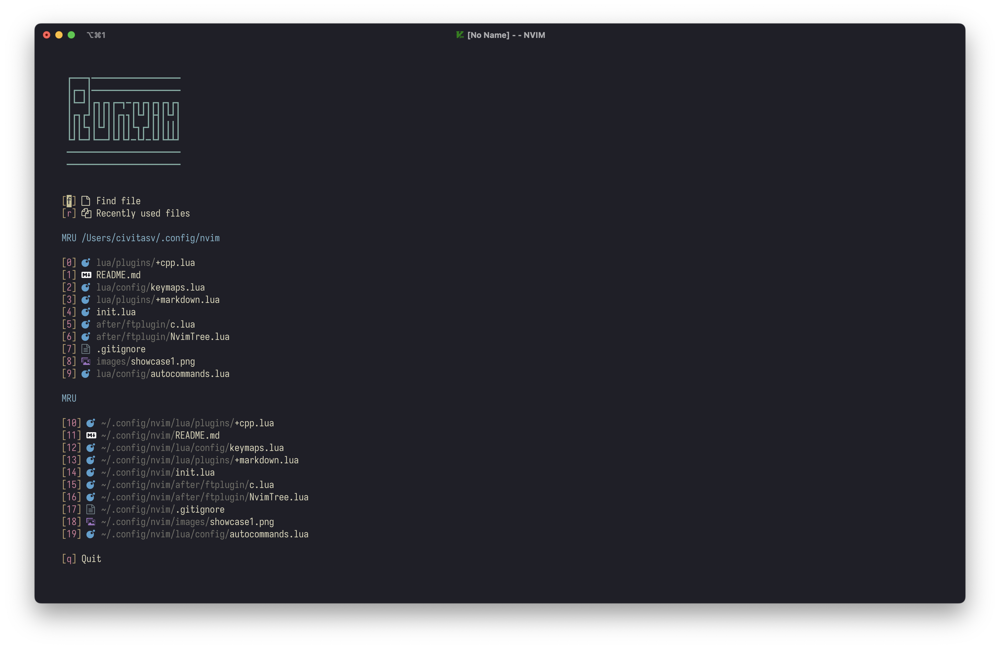
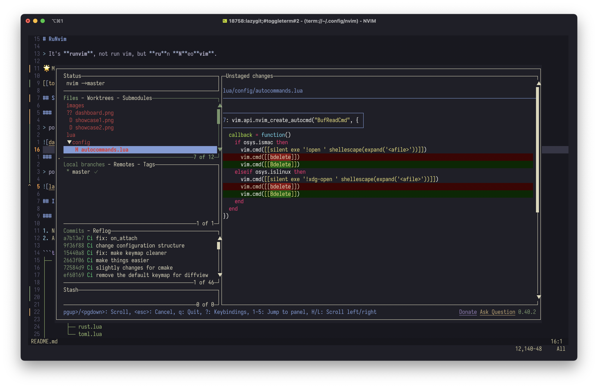
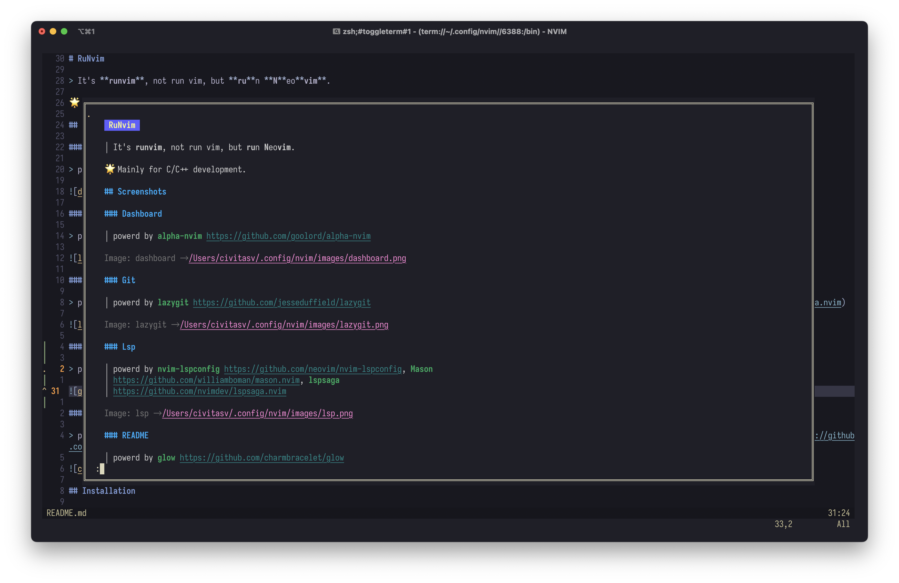
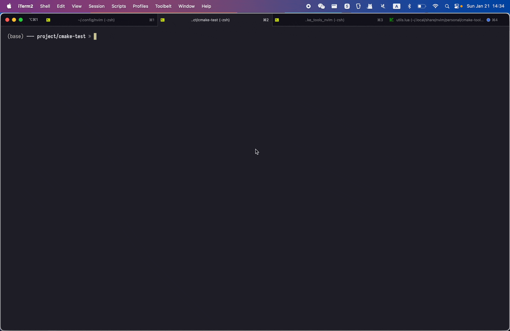

# RuNvim

> It's **runvim**, not run vim, but **ru**n **N**eo**vim**.

🌟 Mainly for C/C++ development.

## Screenshots

### Dashboard

> powerd by [alpha-nvim](https://github.com/goolord/alpha-nvim)



### Git

> powerd by [lazygit](https://github.com/jesseduffield/lazygit)



### Lsp

> powerd by [nvim-lspconfig](https://github.com/neovim/nvim-lspconfig), [Mason](https://github.com/williamboman/mason.nvim), [lspsaga](https://github.com/nvimdev/lspsaga.nvim)


### Markdown Preview

> powerd by [glow](https://github.com/charmbracelet/glow)



### C++

> powerd by [clangd_extensions.nvim](https://github.com/p00f/clangd_extensions.nvim), [cmake_tools.nvim](https://github.com/Civitasv/cmake-tools.nvim), [nvim-dap](https://github.com/mfussenegger/nvim-dap)



## Installation

### Pre-requisites

1. Neovim version > 0.9.
2. A Nerd Font for your terminal.

```txt
├── after
│   └── ftplugin
│       ├── NvimTree.lua
│       ├── c.lua
│       ├── cabal.lua
│       ├── cpp.lua
│       ├── dap-float.lua
│       ├── haskell.lua
│       ├── help.lua
│       ├── rust.lua
│       └── toml.lua
├── init.lua
├── lua
│   ├── config
│   │   ├── autocommands.lua -- auto cmd
│   │   ├── icons.lua        -- icons
│   │   ├── keymaps.lua      -- keybindings
│   │   ├── lazy.lua         -- lazy package manager
│   │   ├── neovide.lua      -- for neovide gui
│   │   └── options.lua      -- useful option
│   ├── plugins
│   │   ├── +colorscheme.lua -- colorscheme
│   │   ├── +cpp.lua         -- for c/cpp
│   │   ├── +dap.lua         -- debug adapter
│   │   ├── +filetree.lua    -- filetree
│   │   ├── +git.lua         -- for git
│   │   ├── +haskell.lua     -- for haskell
│   │   ├── +latex.lua       -- for latex
│   │   ├── +lsp.lua         -- lsp configuration
│   │   ├── +markdown.lua    -- for markdown
│   │   ├── +rust.lua        -- for rust
│   │   ├── +ui.lua          -- ui configuration
│   │   └── +utility.lua     -- utility plugins
└── snippets                 -- custom snippets
    └── tex.snippets
```

### For Unix

```bash
git clone https://github.com/Civitasv/runvim ~/.config/nvim --depth 1 ; nvim
```

### For Windows

```bash
git clone https://github.com/Civitasv/runvim $HOME\AppData\Local\nvim --depth 1 ; nvim
```

## Reference

1. [LunarVim](https://github.com/LunarVim/LunarVim)
2. [NvChad](https://github.com/NvChad/NvChad)
3. [Neovim-from-scratch](https://github.com/LunarVim/Neovim-from-scratch)
