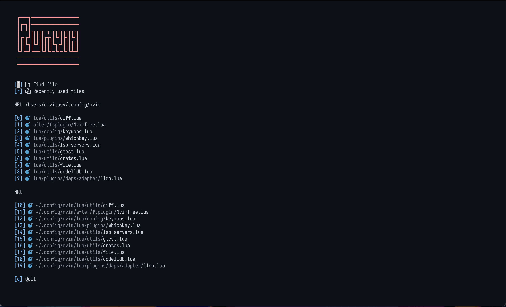
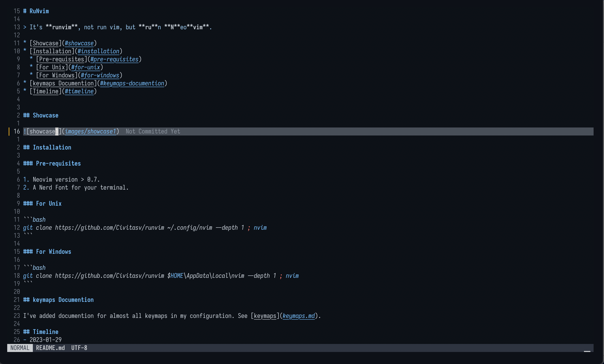

# RuNvim

> It's **runvim**, not run vim, but **ru**n **N**eo**vim**.

* [Showcase](#showcase)
* [Installation](#installation)
  * [Pre-requisites](#pre-requisites)
  * [For Unix](#for-unix)
  * [For Windows](#for-windows)
* [keymaps Documention](#keymaps-documention)
* [Timeline](#timeline)


## Showcase




## Installation

### Pre-requisites

1. Neovim version > 0.9.
2. A Nerd Font for your terminal.

```txt
├── after
│   └── ftplugin
│       ├── NvimTree.lua
│       ├── c.lua
│       ├── dap-float.lua
│       ├── fugitive.lua
│       ├── help.lua
│       ├── rust.lua
│       └── toml.lua
├── init.lua
├── lua
│   ├── config
│   │   ├── autocommands.lua -- auto cmd
│   │   ├── icons.lua        -- icons
│   │   ├── keymaps.lua      -- keybindings
│   │   ├── lazy.lua         -- lazy package manager
│   │   ├── neovide.lua      -- for neovide gui
│   │   └── options.lua      -- useful option
│   ├── plugins
│   │   ├── alpha.lua        -- dashboard
│   │   ├── autopairs.lua    -- autopairs
│   │   ├── catppuccin.lua   -- beautiful theme
│   │   ├── cmake.lua        -- cmake support
│   │   ├── cmp.lua          -- completion
│   │   ├── code-runner.lua  -- run code
│   │   ├── codeium.lua      -- codeium
│   │   ├── comment.lua      -- just comment me
│   │   ├── crates.lua       -- rust
│   │   ├── daps             -- for debugger
│   │   ├── editorconfig.lua -- editorconfig
│   │   ├── github_theme.lua -- github theme, another theme
│   │   ├── gitsigns.lua     -- gitsign
│   │   ├── headlines.lua    -- headline for markdown
│   │   ├── hlargs.lua       -- highlight args
│   │   ├── hop.lua          -- hop!
│   │   ├── impatient.lua    -- maybe don't need it
│   │   ├── indentline.lua   -- indent line
│   │   ├── init.lua         -- entry for plugins
│   │   ├── kanagawa.lua     -- another theme
│   │   ├── lsp              -- for lsp
│   │   ├── lsp_lines.lua    -- lsp lines
│   │   ├── lspsaga.lua      -- for better lsp
│   │   ├── lualine.lua      -- modeline
│   │   ├── markdown.lua     -- markdown support
│   │   ├── mason.lua        -- lsp server manager
│   │   ├── neodev.lua       -- neovim development
│   │   ├── nightfly.lua     -- another theme
│   │   ├── nightfox.lua     -- another theme
│   │   ├── notify.lua       -- vim.notify
│   │   ├── nvim-tree.lua    -- nvim tree
│   │   ├── nvim-ufo.lua     -- fold
│   │   ├── surround.lua     -- surround operation
│   │   ├── telescope.lua    -- find everything
│   │   ├── todo-comments.lua -- todo
│   │   ├── toggleterm.lua   -- toggle terminal
│   │   ├── treesitter.lua   -- treesitter support
│   │   ├── vimtex.lua       -- latex
│   │   └── whichkey.lua     -- which key are you inputting
└── snippets                 -- useful snippets
    └── tex.snippets
```

### For Unix

```bash
git clone https://github.com/Civitasv/runvim ~/.config/nvim --depth 1 ; nvim
```

### For Windows

```bash
git clone https://github.com/Civitasv/runvim $HOME\AppData\Local\nvim --depth 1 ; nvim
```

## Timeline
- 2023-12-19
  - Make it simpler and clearer.
- 2023-01-29
  - Use lazy.nvim to substitute packer.
  > lua/config: basic configuration
  > lua/plugins: plugin spec, will be loaded by lazy.nvim
  > lua/utils: common util function
- 2023-01-11
  - Make debugger easier to use.
- 2022-09-12
  - Use mason & mason-lsp-config to replace lsp-installer.
- 2022-07-23
  - Replace lsp\_lines for showing diagnostic info
- 2022-07-16
  - Add ability to compare file with any older commit.
- 2022-07-14:
  - Add keymaps docs, make it clearer and easier.
  - Add rust crates support.
- 2022-07-07:
  - Add support for LaTeX: vimtex
  - Add Code fold: nvim-ufo
  - Add motion: hop
  - Add autocommand for png, gif, pdf, etc
- 2022-06-18:
  - Lsp Stuff
  - Dap Stuff
  - Treesitter
  - More modern neovim features
- 2022-05-04:
  - Rewrite configuration in lua
  - It's more consistent and more useful
  - Telescope
  - Lsp
  - Dap
  - Treesitter
  - and more

## Reference

1. [LunarVim](https://github.com/LunarVim/LunarVim)
2. [Neovim-from-scratch](https://github.com/LunarVim/Neovim-from-scratch)
