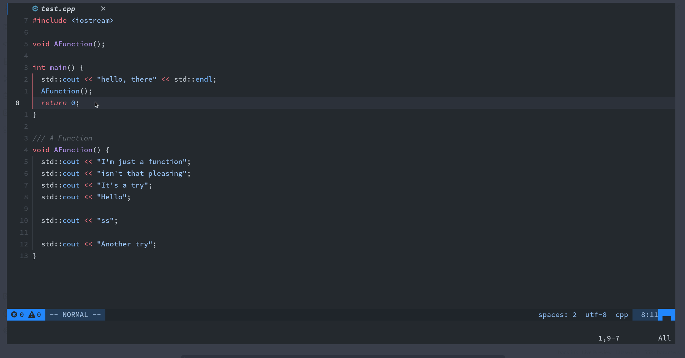
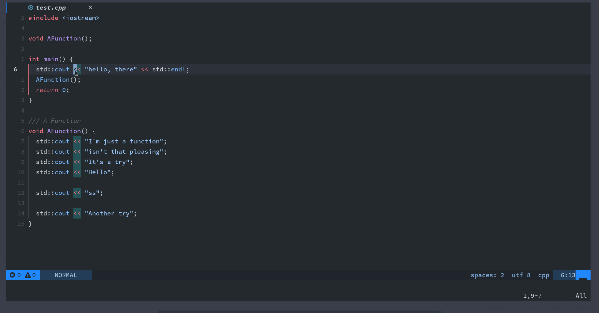
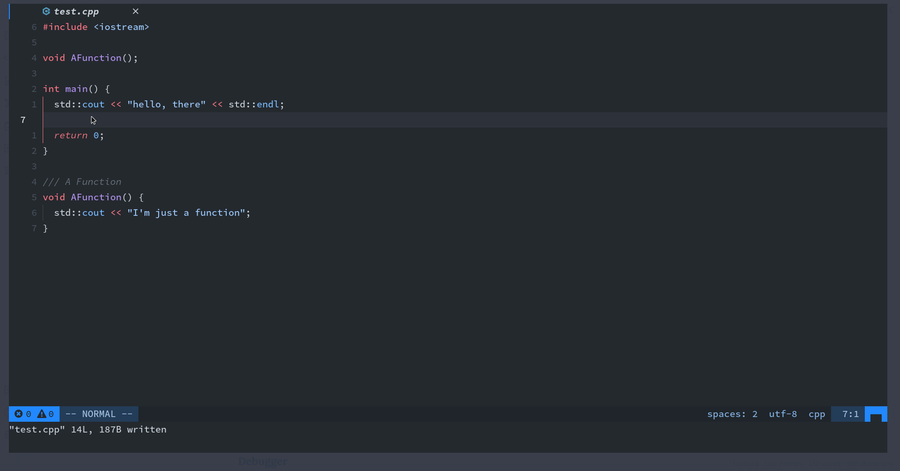
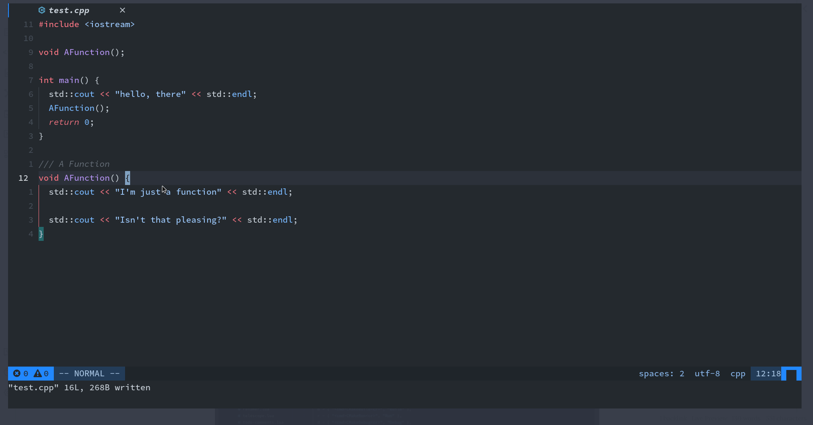
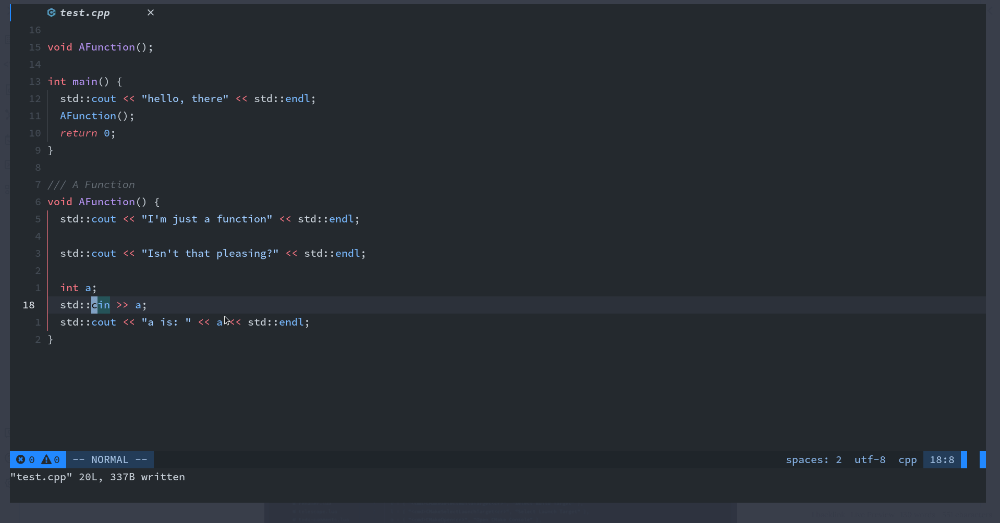
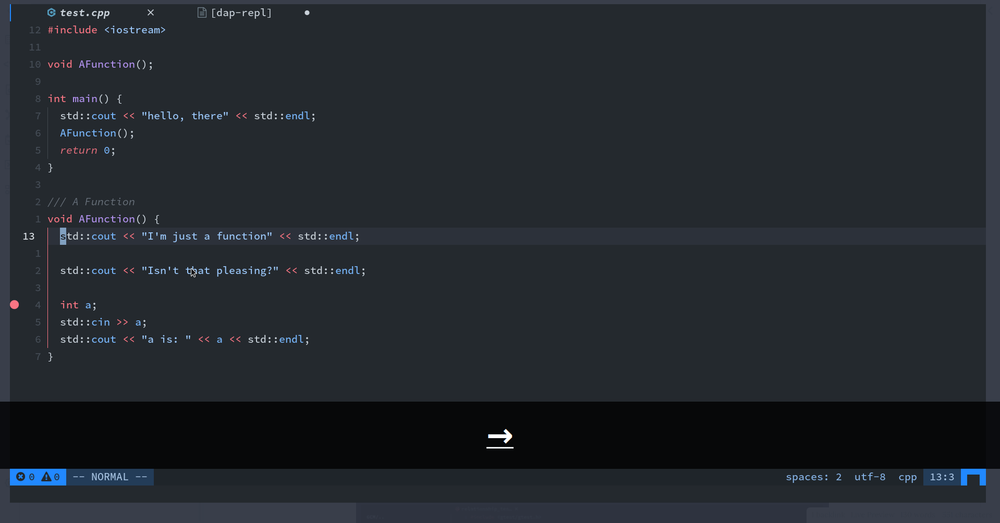

# Neovim Config

> Neovim is a Vim-based text editor engineered for extensibility and usability.

## Timeline

- 2022-06-18:

  - Lsp Stuff
  - Dap Stuff
  - Treesitter
  - More modern neovim features

- 2022-05-04:
  - Rewrite configuration in lua
  - It's more consistent and more useful
  - Telescope
  - Lsp
  - Dap
  - Treesitter
  - and more

## 为什么

1. Blazingly fast ⚡；
2. 支持几乎所有的 Vim 插件；
3. Built-in lua，目前支持使用 Lua 或 Vimscript 配置 Neovim；
4. 几乎完全修改了插件系统，目前几乎可以使用任何语言编写插件；
5. Builtin Lsp；
6. ....

## 个人配置展示

### 搜索

**搜索文字：**

**搜索文件**：

### 智能补全

### Code Runner

### Debugger

### Motion

## Git workflow

1. Basic Blame information: gitsigns
2. Complex Blame information: vim-fugitive
3. Stage, Commit, Push: vim-fugitive
4. Or, Another Beautiful Git integration: lazygit & toggleterm
