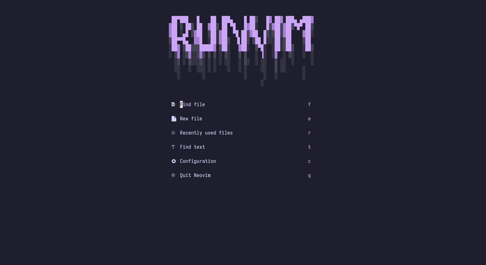
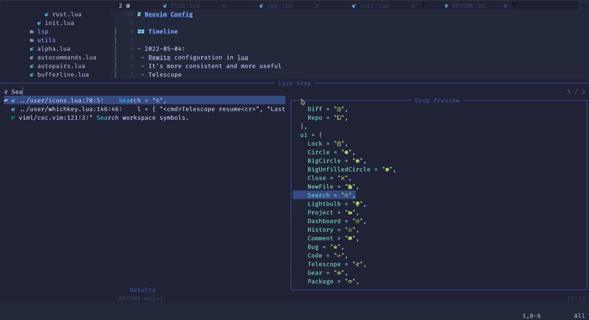
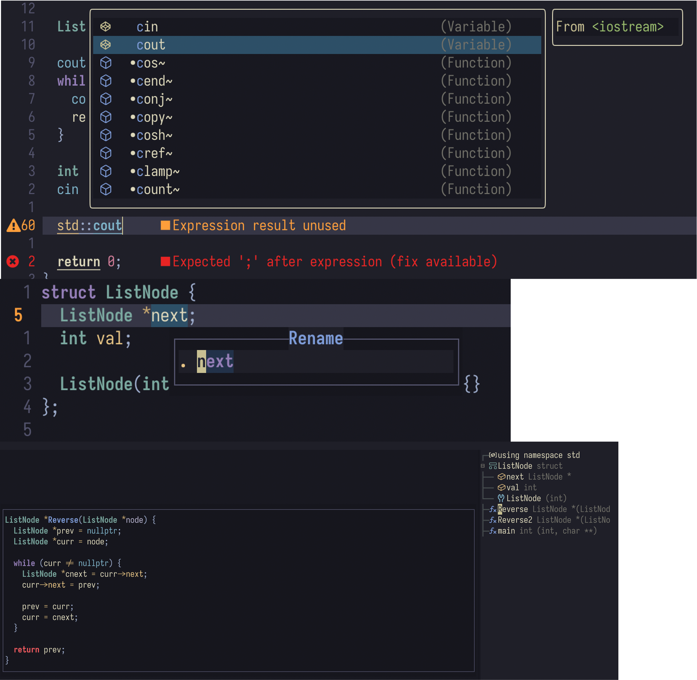
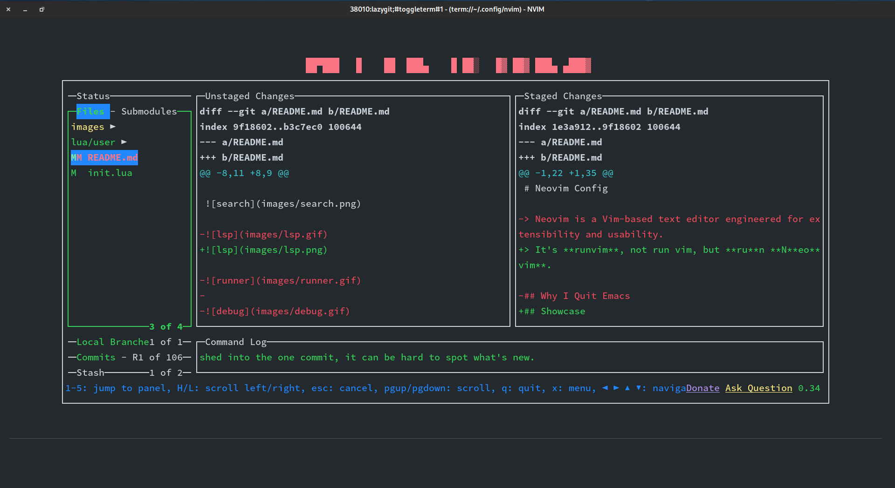
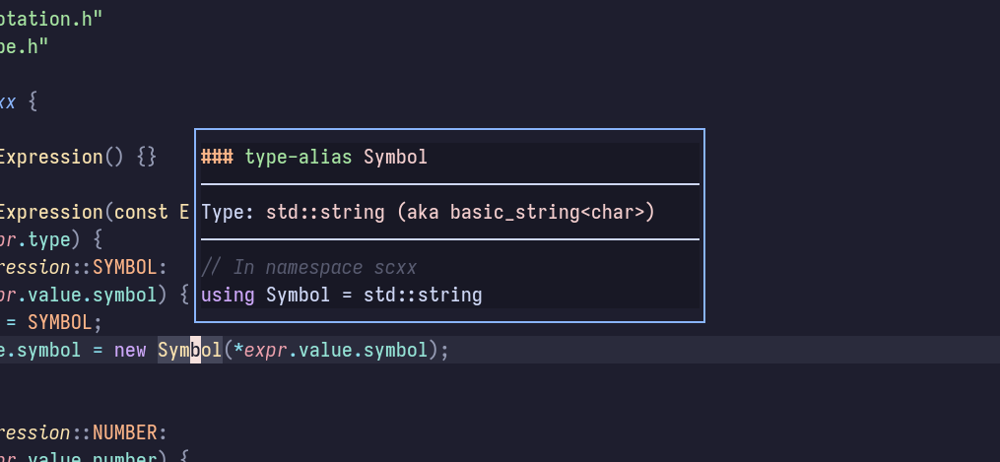
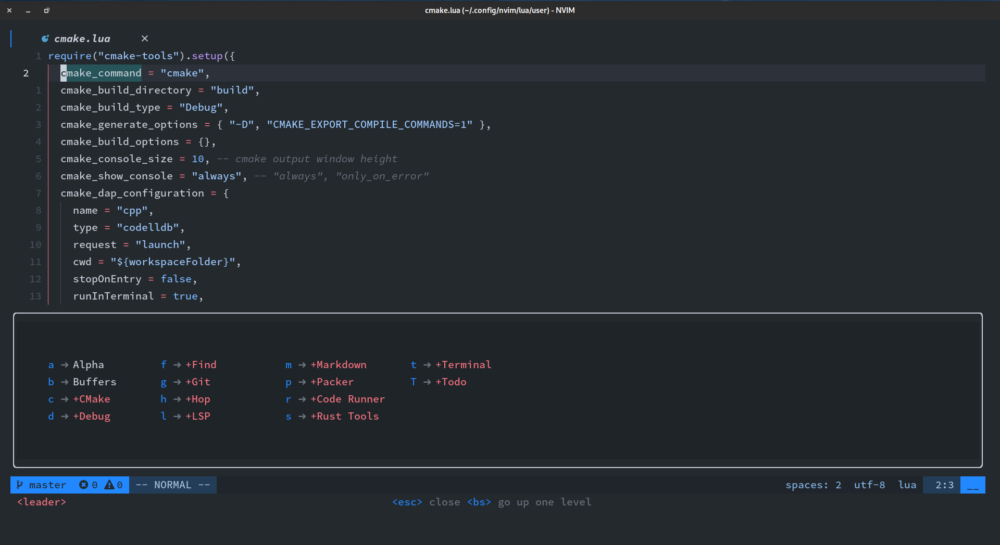
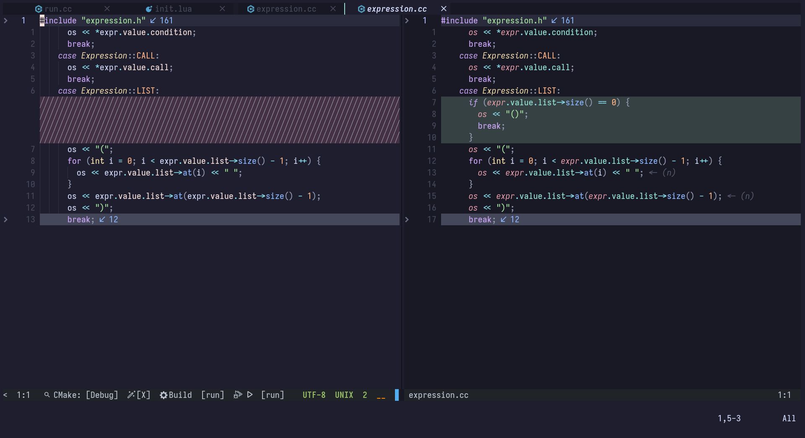
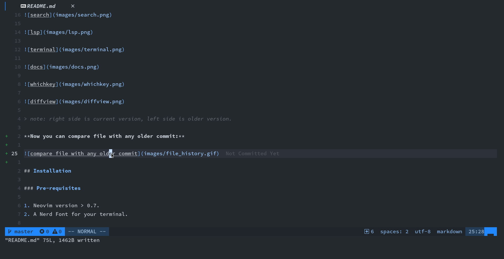
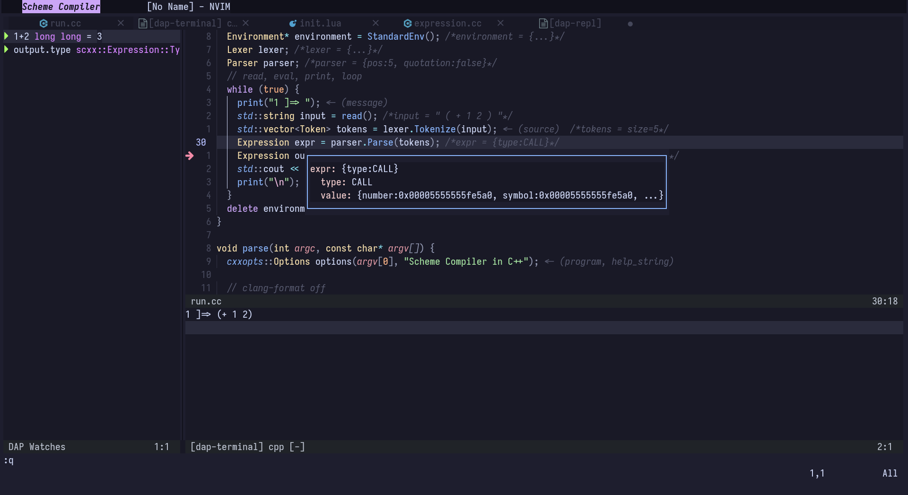

# RuNvim

> It's **runvim**, not run vim, but **ru**n **N**eo**vim**.

* [Showcase](#showcase)
* [Installation](#installation)
  * [Pre-requisites](#pre-requisites)
  * [For Unix](#for-unix)
  * [For Windows](#for-windows)
* [keymaps Documention](#keymaps-documention)
* [Timeline](#timeline)


## Showcase















> note: right side is current version, left side is compared version.

**Now you can compare file with any older commit:**



**And you even can compare older version file with any older version file:**


Now Debugger is a pleasure.



## Installation

### Pre-requisites

1. Neovim version > 0.7.
2. A Nerd Font for your terminal.

### For Unix

```bash
git clone https://github.com/Civitasv/runvim ~/.config/nvim --depth 1 ; nvim
```

### For Windows

```bash
git clone https://github.com/Civitasv/runvim $HOME\AppData\Local\nvim --depth 1 ; nvim
```

## keymaps Documention

I've added documention for almost all keymaps in my configuration. See [keymaps](keymaps.md).

## Timeline
- 2023-01-29
  - Use lazy.nvim to substitute packer.
  > lua/config: basic configuration
  > lua/plugins: plugin spec, will be loaded by lazy.nvim
  > lua/utils: common util function
- 2023-01-11
  - Make debugger easier to use.
- 2022-09-12
  - Use mason & mason-lsp-config to replace lsp-installer.
- 2022-07-23
  - Replace lsp_lines for showing diagnostic info
- 2022-07-16
  - Add ability to compare file with any older commit.
- 2022-07-14:
  - Add keymaps docs, make it clearer and easier.
  - Add rust crates support.
- 2022-07-07:
  - Add support for LaTeX: vimtex
  - Add Code fold: nvim-ufo
  - Add motion: hop
  - Add autocommand for png, gif, pdf, etc
- 2022-06-18:
  - Lsp Stuff
  - Dap Stuff
  - Treesitter
  - More modern neovim features
- 2022-05-04:
  - Rewrite configuration in lua
  - It's more consistent and more useful
  - Telescope
  - Lsp
  - Dap
  - Treesitter
  - and more

## Reference

1. [LunarVim](https://github.com/LunarVim/LunarVim)
2. [Neovim-from-scratch](https://github.com/LunarVim/Neovim-from-scratch)
